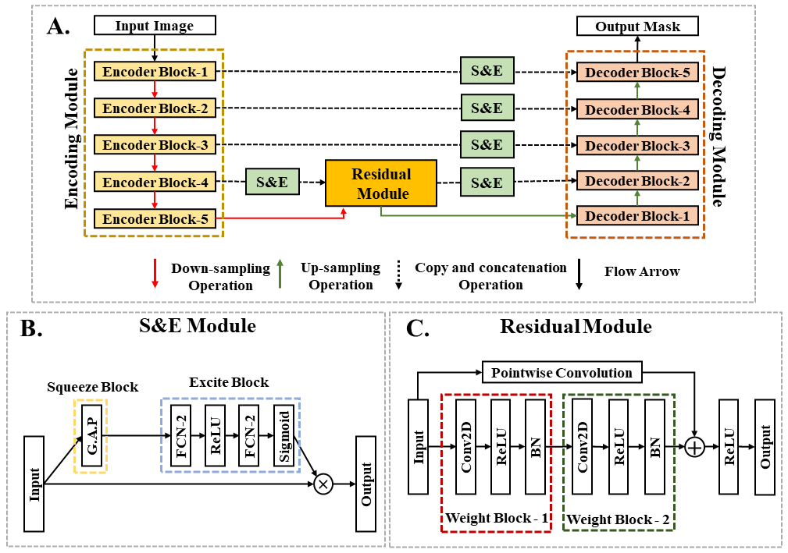

# SE-UResNet


This repository contains the official codebase of SE-UResNet which was accepted in AIHC workshop 2023 of IEEE IRI conference [Paper](https://www.computer.org/csdl/proceedings-article/iri/2023/345800a261/1Q259zGjbH2). SE-UResNet focuses on segmenting multiple organs/regions of interests such as Heart, Lungs, Trachea, Collarbone, and Spine from chest radiograph images.

## Overview
A novel fully connected segmentation model which provides a solution to problem of multiorgan segmentation from Chest X-Rays by incorporating a novel residual module. This module in conjuction with S&E modules in individual decoding pathway improves segmentation accuracy and also makes this model reproducible. The implementation is inspired from ***Attention UW-Net: A fully connected model for automatic segmentation and annotation of chest X-ray***  [Code](https://github.com/Dynamo13/Attention_UWNet) | [Paper]( https://www.sciencedirect.com/science/article/abs/pii/S0010482522007910).

## Network Architecture
<p align="center">

</p>

## Datasets
The datasets used in the paper can be downloaded from the links below:
- [VinDr-RibCXR](https://vindr.ai/datasets/ribcxr)
- [JSRT](http://db.jsrt.or.jp/eng.php)
- [Shenzen](https://www.kaggle.com/datasets/yoctoman/shcxr-lung-mask)
- [NIH CXR](https://www.kaggle.com/datasets/nih-chest-xrays/data)

  In order to download the segmentation masks for NIH data, please refer to the [link](https://drive.google.com/drive/folders/1k4psaxvPJfkQ9DWzcUiLu5ld8ZlwKjnx?usp=sharing)
 ## Code Implementation
 ### Pre-requisites
 For proper implementation of the code, the requirements.txt [file](requirements.txt) is provided. This eases the process of creating a python environment suitable for the reproducibility of the code. This code is developed in ***Python version 3.9***. It is suggested for the user to 
 create a new environment and move the script (.py) files to the file path of the new environment.
 ### Tensorflow implementation
 Script files in conjuction with the jupyter notebook (.ipnyb) [files](SE_UResNet_tf.ipnyb) are provided for implementing the code in ***Tensorflow environment with a version of 2.9.0***. Please run the .ipnyb file to reproduce the code in Jupyter Notebook. The users are required to provide 
 the paths for image (arg1) and mask folders (arg2). The users are also requested to provide a path of their choosing where they want to store the weights (arg3). Note that the weight folder provided should exist in the local machine/cloud. Individual image and masks are required to be in PNG image format.
 In order to implement the code in command prompt/python prompt,run:
 ```
     cd /path/to/env/Model
     python main.py arg1 arg2 arg3
 ```
 The saved weights will be stored under the path provided as an argument as .h5 file.

 In order to display the prediction generated by the model for a single image, run the following code snipet in the python prompt:
 ```python
    from dataloader import *
    from model import *
    from main import *
    from utils import *
    import matplotlib.pyplot as plt
    path = 'image/path/image_name.png'
    model=SE_UResNet((image_height,image_width,image_channel),num_classes, dropout_rate=0.0, batch_norm=True)
    model.compile(optimizer='adam',loss='binary_crossentropy',metrics=['accuracy'])
    model.load_weights(str(weight_dir)+'/weights.h5')

    test_image = cv2.resize(cv2.imread(path),(image_height,image_width))
    predicted_image=model.predict(test_image.reshape(1,image_height,image_width,image_channel))
    plt.imshow(predicted_image[0]>0.5,cmap='gray')
 ```

 
 ### Pytorch Implementation
 
 Please refer to the [notebook](model_pytorch.ipynb) for pytorch implementation.
 
 ## Citation
 If you use this code in your research, please cite:
  ```
  D. Pal, T. Meena and S. Roy, "A Fully Connected Reproducible SE-UResNet for Multiorgan Chest Radiographs Segmentation," 2023 IEEE 24th International Conference on Information Reuse and Integration for Data Science (IRI), Bellevue, WA, USA, 2023, pp. 261-266, doi:     
  10.1109/IRI58017.2023.00052.
  ```
